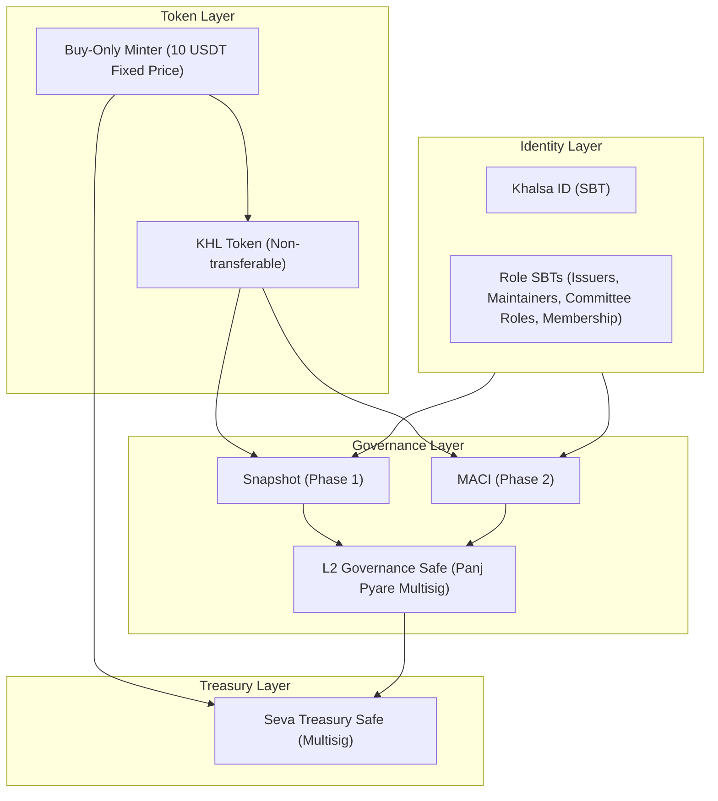
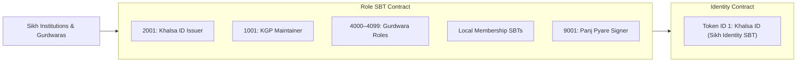
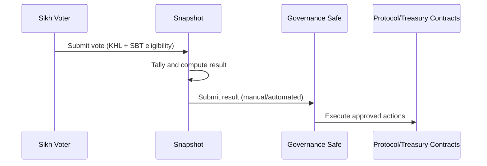
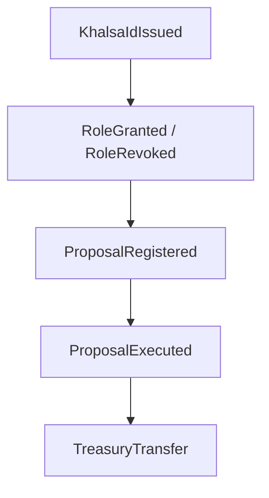

# Khalsa Governance Protocol (KGP)  
### Litepaper v0.2 — 2025  
*A Decentralised Governance & Seva Coordination Framework for the Global Sikh Panth*  

---

# 1. Overview

The **Khalsa Governance Protocol (KGP)** is a decentralised, identity-aware governance and seva (charity) coordination system for the global Sikh Panth. It does not replace Gurdwaras or Sikh institutions. Instead, it provides **neutral, transparent, cryptographically verifiable infrastructure** that institutions and Sangat may adopt voluntarily.

KGP delivers:

- **Khalsa ID (SBT):** Verified Sikh identity (non-transferable).  
- **Role SBTs:** Committee roles, maintainers, issuers, membership, and permissions.  
- **KHL Token:** Non-transferable governance access token (fixed price, buy-only).  
- **Seva Treasury Safe:** Transparent custody of seva funds.  
- **Snapshot Governance (v1):** Identity-gated voting.  
- **MACI Governance (v2):** Zero-knowledge, anti-collusion voting.  
- **Provenance Layer:** Event-based audit trails across identity, governance, and treasury.

KGP aligns with Sikh ethics: *Sarbat da Bhala* (universal welfare), *Seva* (selfless service), *Sat* (truth), *Nimrata* (humility), and collective decision making.

---

# 2. Motivation

Sikh institutions conduct vast seva but lack shared digital infrastructure. Problems commonly seen across the global Panth include:

### • Fragmented governance  
Thousands of Gurdwaras operate independently with no shared digital standards, making cross-institution coordination difficult.

### • No verified digital identity  
There is no global, privacy-preserving way to prove “I am a Sikh” in online governance or seva allocations.

### • No transparent, auditable treasury layer  
Donors often cannot see how funds are allocated, and institutions lack cryptographically verifiable transparency.

### • No secure digital voting  
There is no Panthically aligned method to hold Sybil-resistant, tamper-proof, coercion-resistant online votes.

### • No provenance  
Decisions, identity issuance, and treasury actions are not linked by an immutable chain of governance reasoning.

KGP addresses these gaps while respecting existing maryada, constitutional structures, and institutional autonomy.

---

# 3. Architectural Summary

KGP is implemented entirely on **Arbitrum L2**, enabling low-cost, scalable, and verifiable governance without the complexity of maintaining an L1/L2 split.

## 3.1 Core Components

**1. Identity Layer (Khalsa ID + Role SBTs)**  
- Khalsa ID: Verified Sikh identity (ERC-1155 SBT).  
- Role SBTs: Committee, maintainer, issuer, regional, and project roles.

**2. Token Layer (KHL)**  
- Buy-only, non-transferable ERC-20 style token.  
- Fixed price: **10 USDT**.  
- Purpose: governance access (not financial).  
- Holding ≥1 KHL grants governance participation.

**3. Governance Layer**  
- **v1:** Snapshot with SBT/KHL eligibility checks.  
- **v2:** MACI for ZK, anti-coercion, private voting.  
- **L2 Governance Safe:** Executes approved proposals.

**4. Treasury Layer**  
- Seva Treasury Safe: Multisig holding all stablecoins from KHL mints.  
- All treasury actions require governance approval.  
- Full on-chain provenance.

**5. Provenance Layer**  
Event-based lineage linking:

- Identity → Issuer → Governance → Execution → Treasury  
- Every action has a `decisionId` or `contextId` anchor.

## 3.2 System Architecture Diagram

---

# 4. Identity & Role System (SBTs)

KGP separates **identity** from **roles**, avoiding conflation of Sikh identity with institutional authority.

## 4.1 Khalsa ID (Identity)

- ERC-1155 SBT  
- Token ID: `1`  
- Issued only by approved Sikh institutions  
- Non-transferable; revocable by issuer + governance  
- Required for Panthic governance proposals

## 4.2 Role SBTs (Permissions)

All roles are separate SBT IDs:

- **Issuer SBT (e.g. 2001):** Can mint Khalsa ID.  
- **Maintainer SBT (e.g. 1001):** Can create protocol proposals.  
- **Committee SBTs (e.g. 4000–4099 per Gurdwara):** Local governance roles.  
- **Membership SBTs:** For local Gurdwara voting.  
- **Panj Pyare SBT (e.g. 9001):** L2 Governance Safe signer.

Institutions receive their own SBT namespaces and maintain full autonomy.

## 4.3 Identity & Role Diagram

---

# 5. KHL Token Model

**Purpose:** governance access, not financial value.

- **Non-transferable** (anti-speculation, anti-vote buying).  
- **Fixed price:** 10 USDT.  
- **Minting:** Buy-only contract.  
- **Redemption:** None (no sell-back).  
- **Supply cap:** 96 crore (960 million).  
- **Role:** holding ≥1 KHL enables governance participation.

This model ensures fairness: all Sikhs pay the same amount for participation, at any time.

---

# 6. Governance Lifecycle

KGP uses a staged governance evolution.

## 6.1 Phase 1 — Snapshot Governance (MVP)

- Off-chain voting (gasless for users).  
- Eligibility controlled by SBT + KHL strategies.  
- Proposal categories:
  - **Technical proposals:** ≥1 KHL.  
  - **Panthic + Treasury proposals:** ≥1 KHL + Khalsa ID.  
- Proposal creation:
  - **Technical:** Maintainers + Panj Pyare role SBT holders.  
  - **Treasury:** Any Sikh (KHL + Khalsa ID) with a threshold of endorsements.  
  - **Gurdwara-level:** Committee SBT holders for that Gurdwara.

## 6.2 Governance Flow Diagram (Snapshot → Safe Execution)

## 6.3 Phase 2 — MACI (Zero-Knowledge Governance)

- Encrypted ballots.  
- Anti-coercion.  
- Private voting.  
- ZK proof of correct tally.  
- Strong Sybil resistance.

MACI replaces Snapshot for sensitive votes (Panthic and treasury decisions).

---

# 7. Treasury Architecture

All stablecoins from KHL purchases flow into:

## 7.1 Seva Treasury Safe (L2)

- Multisig Safe on Arbitrum.  
- Only moves funds through governance-approved transactions.  
- All transfers emit `TreasuryTransfer` provenance events.  

Treasury usage is transparent, auditable, and community-driven.

---

# 8. Provenance & Auditability

KGP creates an immutable lineage of:

- Identity issuance.  
- Role changes.  
- KHL minting.  
- Proposal registration.  
- Governance decisions.  
- Treasury movements.  
- Protocol upgrades.  

Through structured events such as:

- `KhalsaIdIssued`.  
- `RoleGranted` / `RoleRevoked`.  
- `KhlMinted`.  
- `MinterWhitelistUpdated`.  
- `ProposalRegistered`.  
- `ProposalExecuted`.  
- `TreasuryTransfer`.  

Each event includes:

- `decisionId` — governance proposal that authorised the action.  
- `contextId` — additional metadata (invite code, institution, region).  
- `contextURI` — optional IPFS/Arweave links.  

This enables complete reconstructability of “how did we get here?” — a foundational requirement for Panthic legitimacy.

## 8.1 Provenance Chain Diagram

---

# 9. Security Model

KGP relies on:

- Arbitrum L2 security guarantees.  
- Safe multisigs.  
- Non-transferable tokens.  
- Identity-gated participation.  
- Event-based provenance.  
- Conservative upgradeability.  
- MACI for coercion-resistant governance.

Threats mitigated:

- Sybil attacks.  
- Vote buying.  
- Committee capture.  
- Identity fraud.  
- Treasury misuse.  
- Protocol-level tampering.

---

# 10. Ethical & Panthic Alignment

KGP preserves and strengthens:

- **Sarbat da Bhala** — welfare of all.  
- **Seva** — selfless contribution.  
- **Nimrata** — humility; no centralised power.  
- **Collective governance** — one-person-one-vote fairness.  
- **Transparency** — open donor accountability.  
- **Autonomy** — no interference with Gurdwaras or institutions.  

KGP is a tool — not an authority.  
It is optional, open-source, non-political, and non-extractive.

---

# 11. Glossary

**Khalsa ID:** SBT proving Sikh identity.  
**SBT:** Soulbound token (non-transferable).  
**KHL:** Governance access token.  
**Panj Pyare:** Collective leadership (5 signers).  
**MACI:** Zero-knowledge voting system providing anti-coercion.  
**Snapshot:** Off-chain voting platform.  
**Seva:** Selfless service.  
**Sarbat da Bhala:** Welfare of all.  

---

# 12. Repository & Contact

**GitHub:** https://github.com/sarbloc/khalsa-governance-protocol  
**Maintainer:** [sarbloc](https://github.com/sarbloc)