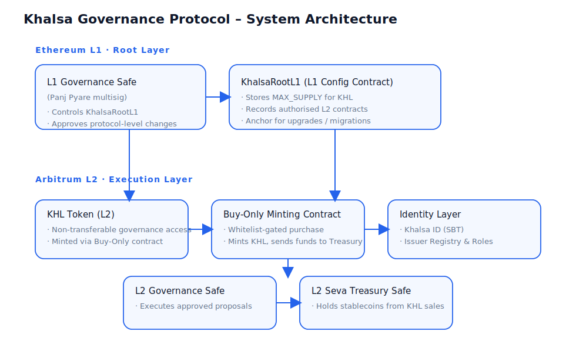
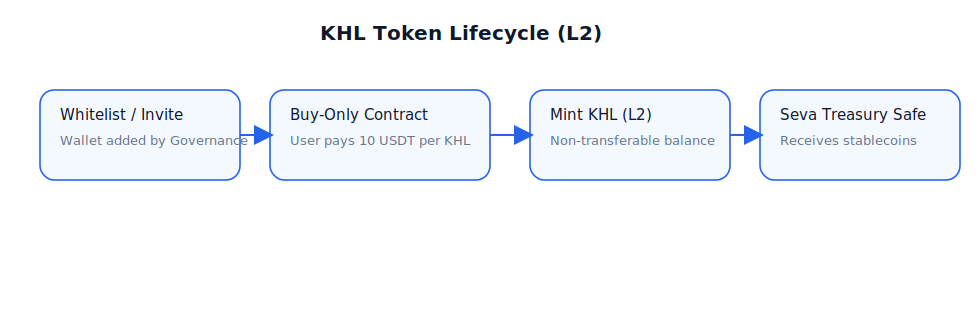
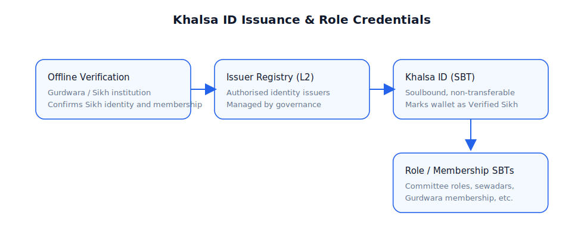
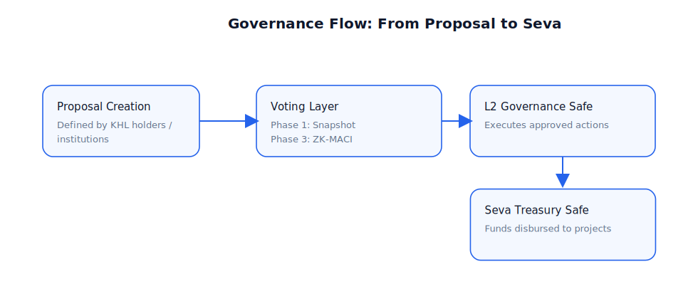
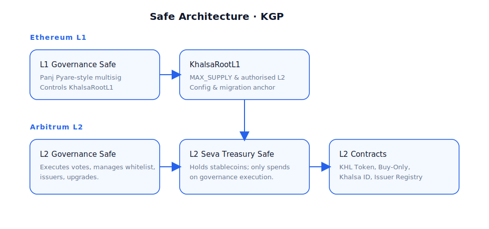
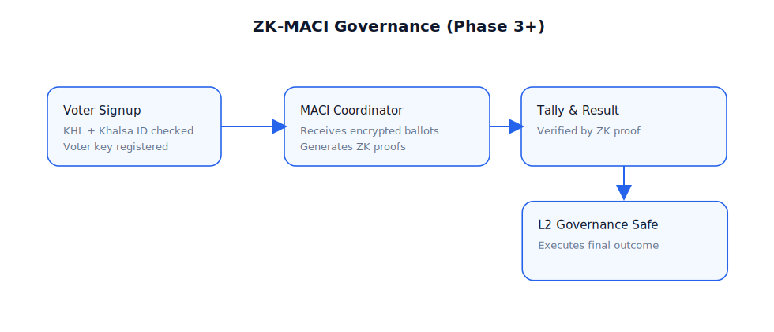
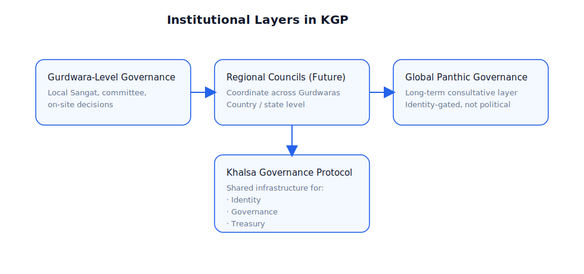

# Khalsa Governance Protocol (KGP)
### A Decentralised Governance and Seva Infrastructure for the Global Sikh Panth  
**Version:** v0.2  
**Published:** 2025  

---

## Table of Contents

1. Abstract  
2. Introduction  
3. Problem Statement  
4. Design Principles  
5. System Architecture Overview  
6. KHL Token Model  
7. Identity Framework (Khalsa ID)  
8. Governance Protocol  
9. Treasury Architecture  
10. Smart Contract Architecture  
11. Risk Analysis  
12. Ethical and Panthic Alignment  
13. Roadmap  
14. Conclusion  
15. Appendix  
16. Disclaimer  
17. References  

---

# 1. Abstract

The **Khalsa Governance Protocol (KGP)** is a decentralised governance and seva coordination framework designed to empower the global Sikh Panth through transparent, secure, and identity-verified collective decision making. KGP integrates Sikh ethical principles - *sarbat da bhala*, *seva*, *nimrata*, equality and accountability - with modern blockchain architecture anchored in Ethereum security.

KGP introduces two core primitives:

1. **KHL Token (non-transferable ERC-20 style)**  
   A fixed-supply, non-transferable governance access token minted exclusively on Arbitrum L2 at a fixed price of 10 USDT. Holding at least 1 KHL grants governance access; holding more does not increase voting power.

2. **Khalsa ID (ERC-1155 Soulbound Token)**  
   A cryptographic Sikh identity credential issued by authorised Gurdwaras or Sikh institutions. It is required for participating in Panthic governance.

Execution is enforced through a dual Safe architecture:

- **L1 Governance Safe (Panj Pyare multisig)**  
  Holds root configuration authority, controls the KhalsaRootL1 contract and defines the global KHL supply cap.

- **L2 Governance Safe**  
  Executes governance-approved actions such as treasury spending, whitelist updates, identity issuer management and limited contract upgrades.

- **L2 Seva Treasury Safe**  
  Holds stablecoins from KHL purchases and releases funds only when governance-approved transactions are executed.

KGP does not replace Sikh institutions.  
It strengthens them by providing transparent, non-political, Panthically aligned digital infrastructure for accountability, seva coordination and global consultation.

---

# 2. Introduction

The Sikh Panth has a long tradition of decentralised governance rooted in Sangat, Panthic consensus and shared seva. Decisions historically emerge from collective reflection, not individual authority. However, in the modern era, governance is fragmented, seva transparency varies across Gurdwaras, and no global digital infrastructure exists for verified Sikh participation.

The **Khalsa Governance Protocol (KGP)** addresses these gaps by providing an identity-gated, transparent, decentralised governance system that any Sikh institution can adopt when, and if, it aligns with its local maryada and practice.

KGP is not a political movement and does not claim to represent or replace any existing Sikh body.  
It is open-source infrastructure which Sikh communities may choose to use for:

- transparent decision making  
- accountable seva funding  
- cross-institutional coordination  
- global consultation rooted in Khalsa values  

---

# 3. Problem Statement

The global Sikh Panth is vibrant, diverse and geographically widespread, yet lacks the digital infrastructure needed for transparent governance, coordinated seva and verified identity. Despite significant community resources, willingness to donate and active youth engagement, the absence of shared governance tools has resulted in fragmentation, inefficiency and avoidable conflict.

This section outlines the key systemic issues KGP aims to address.

---

## 3.1 Governance Fragmentation

Across the world, Sikhs rely on thousands of independently run Gurdwaras and organisations, each with its own constitution, election process, committee structure and interpretation of Panthic governance. There is:

- no common governance standard  
- no shared digital platform for collective decision making  
- no reliable way to coordinate initiatives across borders  
- no merger of information, leading to duplicated effort and misaligned projects  

As a result:

- Gurdwaras often operate in isolation, even when serving the same city or region  
- national or regional councils may not reflect the grassroots Sangat  
- global coordination for emergencies or long-term projects is ad hoc and informal  

Even well-run institutions cannot easily collaborate because there is no shared digital governance layer.

---

## 3.2 Absence of Verified Digital Sikh Identity

There is currently no digital identity layer for Sikhs, not because Gurdwaras have failed to implement one, but because such infrastructure has never existed in a form that is practical, trustworthy or aligned with local traditions.

Most Gurdwaras prioritise physical presence. For many committees, this is intentional:

- they want decisions influenced by people who actually attend the Gurdwara  
- they prefer to recognise the local Sangat over online participants  
- they are cautious of digital systems that may dilute local authority  
- they avoid online voting due to fear of anonymous interference or fake identities  

These concerns are reasonable.

However, in the modern global context, the lack of digital Sikh identity results in:

- no secure method for verifying a Sikh online  
- no way to confirm membership in a Gurdwara without physical paperwork  
- no mechanism for Sikh organisations to collaborate digitally in a verifiable way  
- no way to ensure one-person-one-vote outside a physical location  
- difficulty involving global diaspora in Panthic consultation  
- vulnerability to online impersonation, bots and misinformation  

Importantly:

**Gurdwaras are not failing at digital identity - they simply do not have the tools yet, and existing governance norms favour physical participation.**

KGP provides optional identity infrastructure which Gurdwaras can adopt only if and when it aligns with their values, without replacing their local membership rules.

---

## 3.3 Lack of Transparent Seva Funding

Sikhs donate generously. Yet many institutions struggle with:

- opaque accounting  
- infrequent or incomplete financial reporting  
- unclear processes around allocation of funds  
- no real-time visibility of how seva funds are being used  
- centralised control of bank accounts by a very small number of signatories  

Examples include:

- committees where only two or three individuals have effective control over large treasuries  
- overlapping fundraisers for the same cause due to lack of coordination  
- donors being unable to track whether pledges reached their intended projects  
- projects announced publicly but with little follow up on impact  

This does not imply bad intent in every case, but **the lack of transparent, auditable infrastructure** makes it easy for mistrust and speculation to grow, particularly among younger Sikhs and the diaspora.

---

## 3.4 Political Capture and Factionalism

In many places, Gurdwara governance mirrors local political culture. Patterns include:

- elections run as rival slates or party-like groupings  
- committees aligned along narrow cultural or ideological lines  
- decisions influenced by local factional loyalties rather than Panthic priorities  
- important appointments and spending decisions made behind closed doors  

Over time, this leads to:

- Sangat feeling sidelined or disengaged  
- younger Sikhs feeling locked out of decision making  
- resources being used in ways that do not reflect wider community wishes  
- fractures between different groups within the same local community  

KGP does not attempt to adjudicate these issues or label any particular body as legitimate or illegitimate. Rather, it provides:

- tools for transparent consultation  
- identity-gated voting processes  
- clear, auditable execution of decisions  

so that institutions which wish to improve their governance have credible infrastructure to do so.

---

## 3.5 No Global Infrastructure for Panthic Coordination

When global crises occur - environmental disasters, humanitarian emergencies, attacks on Sikh institutions, or broader justice movements - the Sikh response is often rapid but fragmented. Common patterns include:

- multiple organisations launching overlapping appeals with limited coordination  
- no common registry of projects and initiatives  
- difficulty routing funds to the most impactful efforts  
- limited ability to gather inclusive Panthic consensus on global questions  

Similarly, long-term priorities such as education, media, heritage preservation and support for vulnerable communities are often addressed in isolation by individual organisations.

The Panth is deeply connected in spirit, but digitally disconnected in practice. A modern governance layer must reflect the needs of a global community while respecting local autonomy.

---

## 3.6 Summary

These issues - fragmentation, lack of digital identity, opaque funding, political capture and absence of global infrastructure - are not caused by a lack of goodwill or seva. They are caused by the **absence of shared, trustworthy, Panthically-aligned digital infrastructure**.

KGP aims to provide:

- a verified identity layer  
- a transparent, on-chain treasury  
- a non-speculative governance access token  
- Safe-based execution with distributed responsibility  
- a neutral coordination layer for Sikh institutions  

so that existing structures can work together more effectively, if and when they choose to.

---

# 4. Design Principles

KGP is built upon the following foundational principles, aligned with Sikh ethics and modern decentralised architecture:

- **Sarbat da bhala:** All governance and treasury actions should prioritise universal welfare and collective upliftment, not narrow interests.  
- **Seva-centric economics:** KHL exists solely to support seva. It is non-transferable, fixed-price and non-speculative.  
- **Decentralisation:** Power is distributed across Safes, identity issuers and governance participants, preventing capture by any single actor or institution.  
- **Identity-based governance:** Verified Sikh identity (Khalsa ID) allows one-person-one-vote in Panthic matters while keeping personal data off-chain.  
- **Transparency:** Treasury movements and governance decisions are publicly auditable on-chain, increasing trust and accountability.  
- **Non-exploitation:** The protocol avoids profit extraction, token speculation and financial incentives that conflict with Sikh values.  
- **Minimal trust:** Smart contracts and multisig structures enforce rules, reducing reliance on personal trust and closed-door arrangements.  
- **Evolution with the Sangat:** The protocol adapts via democratic, identity-gated decision making, ensuring alignment with community needs and Panthic principles over time.

---

# 5. System Architecture Overview

KGP combines four primary subsystems:

1. **KHL Token Layer**  
   A fixed-supply, non-transferable governance access token minted on Arbitrum L2 via a buy-only mechanism.

2. **Identity Layer (Khalsa ID and Role Credentials)**  
   Soulbound credentials that prove Sikh identity and model institutional structures (Gurdwara membership, committee roles, regional affiliation).

3. **Governance Layer (Snapshot progressing to ZK-MACI)**  
   A staged approach to governance, starting with accessible off-chain voting and evolving to private, coercion-resistant, verifiable ZK voting.

4. **Treasury Layer (Seva Treasury Safe)**  
   A Safe on L2 which holds stablecoins from KHL purchases and only disburses funds on governance-approved execution.

KGP uses a two-layer security model:

- **Ethereum L1 - root layer**  
  L1 Governance Safe plus the KhalsaRootL1 contract define the global KHL supply cap and register authorised L2 contracts.

- **Arbitrum L2 - execution layer**  
  All user interactions, minting, identity issuance, governance flows and treasury operations occur on L2 for lower cost and better usability.

### Diagram: System Architecture



---

## 5.1 L1 Root Layer

Ethereum L1 provides the cryptoeconomic security foundation. KGP uses L1 for:

- storing the maximum KHL supply (MAX_SUPPLY)  
- recording the set of authorised L2 contracts  
- providing a root anchor for upgrades or migrations  
- ensuring that control over these functions requires a Panj Pyare style multisig (L1 Governance Safe)

This keeps L1 usage minimal but highly significant: the L1 layer acts as the constitutional root of the protocol.

---

## 5.2 L2 Execution Layer

Arbitrum L2 hosts all operational components:

- KHL token contract (non-transferable ERC-20 style)  
- Buy-Only minting contract  
- Khalsa ID and role SBTs  
- Issuer Registry  
- L2 Governance Safe  
- L2 Seva Treasury Safe  

L2 is chosen for:

- low transaction fees  
- high throughput  
- compatibility with Ethereum tooling  
- future support for privacy-preserving governance constructions such as MACI

---

## 5.3 Execution Flow Overview

At a high level, the execution flow consists of four steps:

1. **KHL distribution**  
   - Whitelisted wallets purchase KHL at a fixed price of 10 USDT via the Buy-Only contract.  
   - Stablecoins are sent directly to the Seva Treasury Safe.  
   - Non-transferable KHL is minted to the buyer on L2.

2. **Identity verification**  
   - Sikh identity is verified offline by an authorised Gurdwara or Sikh institution.  
   - An issuer mints a Khalsa ID SBT and any relevant role SBTs to the wallet.

3. **Governance**  
   - Proposals are created by eligible participants.  
   - Voting initially uses Snapshot, then later ZK-MACI, depending on the phase.  
   - Results are passed to the L2 Governance Safe.

4. **Treasury and contract execution**  
   - The L2 Governance Safe executes the approved action, which may include:  
     - sending funds from the Seva Treasury Safe  
     - updating whitelists  
     - updating the Issuer Registry  
     - performing limited contract upgrades

---

# 6. KHL Token Model

## 6.1 Token Definition

KHL is a non-transferable, governance access token deployed on Arbitrum L2. It has the following properties:

- **Standard:** ERC-20 style interface with disabled transfer functions  
- **Supply:** Fixed maximum supply of 96 crore (960,000,000)  
- **Price:** 10 USDT per KHL, fixed  
- **Minting:** Only via Buy-Only contract on L2, subject to MAX_SUPPLY defined on L1  
- **Transferability:** Transfer and transferFrom revert; tokens cannot be traded or moved between wallets  
- **Redemption:** There is no redemption or buy-back mechanism  
- **Rights:** KHL does not represent financial rights, equity, or profit claims; it is solely an access credential for governance

## 6.2 Token Roles

KHL serves four primary roles:

1. **Governance access**  
   A wallet holding at least 1 KHL is eligible to participate in technical governance proposals.

2. **Panthic intent signal**  
   For Panthic matters, eligibility additionally requires a Khalsa ID. KHL signals that the holder has chosen to support and participate in the governance process.

3. **Seva contribution mechanism**  
   Each KHL purchase channels funds into the Seva Treasury Safe, creating a direct link between governance participation and funding of seva.

4. **Non-transferable participation credential**  
   Because KHL cannot be traded, it does not accumulate as a symbol of wealth or speculative investment. It acts as a durable proof that a wallet has opted in to KGP governance.

## 6.3 Token Lifecycle

The basic lifecycle of KHL is:

1. A Sikh or ally is invited and their wallet is added to the whitelist.  
2. The wallet calls the Buy-Only contract and pays 10 USDT per KHL.  
3. Stablecoins are transferred to the Seva Treasury Safe.  
4. The KHL contract mints non-transferable KHL to the buyer’s wallet.  
5. Transfer and transferFrom are disabled at the contract level.  
6. KHL may be burned only in exceptional, governance-approved processes (for example, identity recovery).

### Diagram: KHL Token Flow



## 6.4 Distribution Phases

KHL distribution proceeds in phases:

- **Phase 0 - Manual invite only**  
  The whitelist is managed directly by KGP operators and early trusted participants.

- **Phase 1 - Trusted inviter network**  
  Certain wallets receive the right to add other wallets to the whitelist. These roles are controlled by governance.

- **Phase 2 - Identity-gated onboarding**  
  Gurdwaras and Sikh institutions may choose to link Khalsa ID issuance with KHL eligibility.

- **Phase 3 - Institutional distribution**  
  Gurdwaras and Panthic bodies may, if they wish, embed KHL minting within their local membership or consultation processes.

## 6.5 Fixed Price

The price of 10 USDT per KHL is fixed. This:

- avoids price speculation and volatility  
- ensures late adopters are not penalised compared to early adopters  
- keeps the system simple and predictable  
- supports a non-extractive economic model aligned with seva

## 6.6 No Redemption Mechanism

KHL cannot be sold back to the protocol. This is deliberate:

- it avoids creating an implicit liability on the Seva Treasury  
- it prevents bank-run dynamics or pressure to maintain a peg  
- it helps preserve the non-financial nature of KHL  
- it ensures funds collected for seva remain available for seva

## 6.7 Non-transferability

The KHL contract disables transfers:

```solidity
function transfer(address, uint256) public pure returns (bool) {
    revert("NON_TRANSFERABLE");
}

function transferFrom(address, address, uint256) public pure returns (bool) {
    revert("NON_TRANSFERABLE");
}
```

Non-transferability:

- prevents vote buying and token farming  
- makes it difficult to centralise influence through financial means  
- ensures KHL is a participation credential, not a tradeable asset  
- is consistent with a seva-first, non-speculative design

---

# 7. Identity Framework (Khalsa ID)

## 7.1 Definition

Khalsa ID is an ERC-1155 Soulbound Token that represents verified Sikh identity for a particular wallet. It does not store personal data on-chain. Instead, it acts as a binary marker: this wallet belongs to a Sikh who has been verified by an authorised issuer.

Khalsa ID is required for:

- voting on Panthic proposals  
- taking certain institutional roles within KGP  
- future global Panthic consultations

## 7.2 Issuer Registry

The Issuer Registry contract on L2 tracks which entities are allowed to issue Khalsa ID and related role credentials. Typically, these issuers will be:

- Gurdwaras  
- Sikh organisations / educational institutions  
- Regional or Panthic bodies recognised by governance

The Issuer Registry is administered by the L2 Governance Safe, which can:

- add or remove issuers  
- update issuer metadata  
- suspend or revoke issuers in case of misuse

## 7.3 Issuance Workflow

A typical issuance workflow is:

1. A Sikh presents themselves to a Gurdwara or Sikh institution.  
2. The institution performs its usual verification (for example, membership checks, local knowledge, or other criteria).  
3. The institution, if listed in the Issuer Registry, calls the Khalsa ID contract to mint a Khalsa ID SBT to the person’s wallet.  
4. Additional role or membership SBTs may be issued to represent committee roles, seva responsibilities or institutional membership.

### Diagram: Khalsa ID Issuance



## 7.4 Privacy Characteristics

KGP is designed to minimise on-chain personal data:

- no names, addresses or documents are stored on-chain  
- Khalsa ID is simply a flag that a given wallet is verified  
- verification occurs off-chain, according to issuer processes  
- future integrations can support zero-knowledge based proofs without revealing identity attributes

## 7.5 Hierarchical Identity Structure

Khalsa ID is the foundation of a hierarchical identity structure:

- **Individual level:** Sikh identity (Khalsa ID)  
- **Institutional level:** Gurdwara membership, committee roles, seva roles (role SBTs)  
- **Regional level (future):** Representation at regional councils or umbrella bodies  
- **Global level (long term):** Participation in global Panthic consultations or protocol-wide decisions

---

# 8. Governance Protocol

## 8.1 Objectives

The governance system aims to:

- enable fair, transparent decision making  
- ensure that Sikh identity and participation are correctly represented  
- prevent centralised capture of control  
- provide clear, auditable execution of decisions  
- evolve as the Sangat and institutions gain experience with KGP

## 8.2 Eligibility

Eligibility rules vary by proposal type.

- **Panthic proposals (religious or community-wide matters):**  
  - wallet must hold a Khalsa ID  
  - wallet must hold at least 1 KHL  

- **Technical or protocol proposals:**  
  - wallet must hold at least 1 KHL  
  - Khalsa ID may not be required, depending on the category

These rules can be refined through governance over time.

## 8.3 Weighting

As a baseline, KGP uses one-person-one-vote for eligible wallets. This is enforced through:

- non-transferable KHL  
- Khalsa ID gating for Panthic matters  
- anti-Sybil mechanisms in future MACI-based voting

Alternative weighting schemes (for example, institution-level representation) may be introduced by future governance.

## 8.4 Governance Layers

KGP is designed to support multiple governance layers:

- **Gurdwara level:** local decisions by local Sangat, possibly using KGP tools for transparency and treasury flows if desired  
- **Regional level (future):** councils made up of multiple institutions within a region or country  
- **Global level (long term):** consultative global decisions where identity and KHL provide a shared basis for participation

## 8.5 Voting Mechanisms

KGP adopts a phased approach to voting:

- **Phase 1 - Snapshot-based voting**  
  - simple off-chain vote recording  
  - widely used in the Ethereum ecosystem  
  - cost effective and easy to integrate

- **Phase 3 - ZK-MACI based voting**  
  - Minimum Anti-Collusion Infrastructure (MACI)  
  - encrypted ballots  
  - zero-knowledge proofs of correct tally  
  - resistance to coercion and vote-buying  
  - better privacy for participants

### Diagram: Governance Flow



## 8.6 Proposal Types

Common proposal types include:

- **Informational proposals**  
  - record non-binding statements  
  - gather sentiment on key topics  

- **Treasury allocation proposals**  
  - propose a specific spend from the Seva Treasury  
  - specify beneficiary, amount and purpose  

- **Contract execution proposals**  
  - update whitelists  
  - add or remove issuers  
  - upgrade contracts where permitted  
  - change governance configuration (subject to safeguards)

## 8.7 L2 Governance Safe (Execution Layer)

The L2 Governance Safe is the execution engine for all governance decisions. It:

- receives the outcome of votes  
- initiates on-chain actions corresponding to approved proposals  
- interacts with the Seva Treasury Safe, KHL contract, Buy-Only contract, Issuer Registry and other L2 contracts  
- can only act according to the authorisations defined in protocol contracts

The Governance Safe does not hold large amounts of funds (that is the role of the Treasury Safe) and cannot change the MAX_SUPPLY or the L1 root configuration, which remain under the control of the L1 Governance Safe and KhalsaRootL1.

---

# 9. Treasury Architecture

## 9.1 Goals

The Treasury system is designed to:

- provide transparent, accountable handling of seva funds  
- separate decision making (governance) from custody (treasury)  
- minimise trust in individual signatories  
- ensure that all disbursements are traceable back to specific proposals and votes

## 9.2 Components

The main components of the Treasury architecture are:

- **L2 Seva Treasury Safe**  
  - holds stablecoins from KHL purchases  
  - funds all protocol-recognised seva spending  

- **L2 Governance Safe**  
  - triggers treasury transactions after successful votes  

- **Buy-Only Contract**  
  - accepts stablecoins from whitelisted wallets  
  - mints KHL and forwards funds to the Treasury Safe

### Diagram: Safe Architecture



## 9.3 Seva Treasury Safe

The L2 Seva Treasury Safe is a multi-signature Safe on Arbitrum. Its properties:

- receives 100% of the stablecoins used to purchase KHL  
- cannot mint KHL or alter governance logic  
- can only send funds when a transaction is initiated by the Governance Safe or configured modules  
- can use additional modules and time delays for further security if required

## 9.4 Buy-Only Contract

The Buy-Only contract:

- sells KHL at a fixed price of 10 USDT per token  
- is restricted to a governance-managed whitelist of buyers  
- sends stablecoins directly to the Seva Treasury Safe  
- calls the KHL contract to mint non-transferable tokens  
- is not upgradeable without strict governance processes (and possibly L1 confirmation in future versions)

## 9.5 No Sell-back Mechanism

The Treasury does not provide a mechanism for selling KHL back. This avoids:

- creating financial obligations on the protocol  
- encouraging speculative behaviour  
- turning KHL into a de facto investment instrument

Treasury funds are solely for seva and protocol operations.

## 9.6 Treasury Allocation Flow

1. A proposal is created specifying a requested treasury spend.  
2. Eligible participants vote.  
3. If the proposal passes, the Governance Safe initiates a transaction from the Seva Treasury Safe to the specified beneficiary.  
4. The transaction and its link to the proposal are visible on-chain.

---

# 10. Smart Contract Architecture

## 10.1 Overview

The KGP smart contract suite includes:

- **KhalsaRootL1 (Ethereum L1)**  
  - stores MAX_SUPPLY  
  - records authorised L2 contracts  
  - acts as a configuration and migration anchor  

- **L1 Governance Safe**  
  - multisig representing Panj Pyare style constitutional authority over KhalsaRootL1  

- **KHL Token (L2)**  
  - non-transferable ERC-20 style token  
  - minting restricted to Buy-Only contract  

- **Buy-Only Minting Contract (L2)**  
  - handles whitelisted purchases and forwards funds to Treasury  

- **Khalsa ID (L2)**  
  - ERC-1155 SBT representing verified Sikh identity  

- **Issuer Registry (L2)**  
  - tracks authorised Khalsa ID issuers  

- **Role / Membership SBTs (L2)**  
  - represent committee and institutional roles  

- **L2 Governance Safe**  
  - execution engine for governance decisions  

- **L2 Seva Treasury Safe**  
  - custody of stablecoins  

### Diagram: Contract Architecture


(A more detailed contract-specific diagram can be introduced in later versions.)

## 10.2 Upgradeability

KGP uses a conservative upgradeability philosophy:

- critical contracts may be non-upgradeable or upgradeable only via strict multisig and governance procedures  
- where proxies are used, upgrade paths and authorities are clearly defined  
- upgrades are expected to be relatively infrequent and focused on security or necessary protocol evolution

## 10.3 Security Assumptions

The protocol relies on:

- the security of Ethereum L1 and Arbitrum L2  
- correct implementation and auditing of KGP contracts  
- honest majority within the L1 and L2 Safes, based on diverse and trusted signers  
- careful management of private keys and operational security by signers

---

# 11. Risk Analysis

A detailed threat model will be developed in future versions. Broadly, risks include:

- identity risks (false claims, issuer collusion, compromised wallets)  
- governance risks (voter apathy, capture by small groups, poor proposal design)  
- treasury risks (misallocation, operational mistakes, signer compromise)  
- technical risks (contract bugs, bridge issues, L2 outages)  
- social risks (resistance from institutions, misalignment of expectations)

Mitigation strategies include:

- incremental rollout  
- audits  
- conservative permissions  
- clear documentation  
- ongoing community feedback and adaptation

---

# 12. Ethical and Panthic Alignment

KGP aims to:

- support Sarbat da bhala through well directed seva funding  
- promote equality by avoiding wealth-based voting power  
- encourage transparency and accountability in community institutions  
- reflect Sikh values of collective decision making and humility  
- avoid involvement in partisan politics or state-level political struggles  

KGP is a toolset. How it is used will depend on the institutions and Sangat that adopt it, but its design is explicitly shaped to support Panthic ethics rather than undermine them.

---

# 13. Roadmap

A high-level roadmap:

- **Phase 1 - MVP launch (2025)**  
  - KHL non-transferable token on L2  
  - Buy-Only contract  
  - basic L2 Governance Safe and Seva Treasury Safe  
  - initial Khalsa ID and Issuer Registry

- **Phase 2 - Gurdwara and organisation integration (2025-2026)**  
  - pilot integrations with willing Gurdwaras and Sikh organisations  
  - expansion of role SBTs  
  - iterative improvement of UI and governance processes

- **Phase 3 - ZK governance (2026-2027)**  
  - MACI based privacy preserving voting  
  - stronger anti-coercion and anti-collusion guarantees  
  - regional and multi-institution governance experiments

- **Phase 4 - Global Panthic governance (2027 and beyond)**  
  - optional use for global consultations and joint initiatives  
  - further research into alignment with Sarbat Khalsa type processes

### Diagram: MACI Governance Flow (Future Phase)



### Diagram: Institutional Layers



---

# 14. Conclusion

The Khalsa Governance Protocol (KGP) is an attempt to bring together Sikh values and modern decentralised technology in a way that supports, rather than replaces, existing community structures. It provides:

- a non-speculative governance access token (KHL)  
- an identity framework respectful of local verification practices  
- a transparent, Safe-based treasury for seva funds  
- a staged governance pathway from Snapshot to ZK-MACI  

KGP is offered as an open-source, Panthically minded infrastructure layer. It is up to the Sangat and Sikh institutions to decide how, when and where to use it. The protocol itself will evolve through the very governance process it enables.

---

# 15. Appendix

Future versions of this whitepaper will include:

- formal definitions of eligibility and weighting functions  
- detailed contract interface specifications  
- formal threat models and adversary definitions  
- worked examples of governance and treasury flows  
- references to audited code and deployments

---

# 16. Disclaimer

- KHL is a non-financial governance access token.  
- KHL does not represent equity, profit-sharing or any form of security.  
- There is no expectation of profit from holding KHL.  
- KGP does not replace or claim authority over existing Sikh institutions.  
- KGP is experimental technology and may contain defects.  
- Use of KGP is entirely voluntary and at the discretion of institutions and individuals.

---

# 17. References

(To be populated in later versions. These may include references to MACI, Safe, Arbitrum, Ethereum, and relevant academic or technical work.)